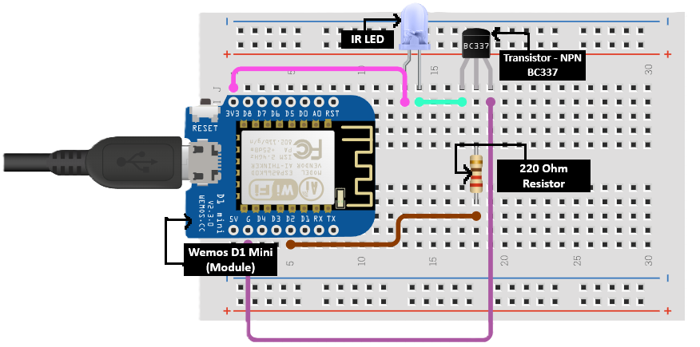
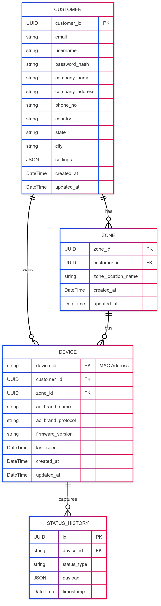

# Internship-Project-AC-Control-IOT


> **A comprehensive IoT system for centralized air conditioning control in workspaces, featuring embedded ESP8266 modules, real-time MQTT communication, and a modern web dashboard.**

## 📋 Project Overview

This project was developed during an 8-week summer internship at **Ellipsis Infotech** (May 5 - June 28, 2025) to create a complete IoT ecosystem for centralized air conditioning control. The system allows multiple AC units to be controlled remotely through a unified dashboard, enabling efficient climate management across large workspaces.

### 🏢 Internship Details
- **Company**: [Linkedin 
](https://www.linkedin.com/company/ellipsis-infotech) | [Website](https://www.ellipsisinfotech.com/)
- **Duration**: 8 weeks (May 5, 2025 - June 28, 2025)
- **Mentor**: [Shyamal Shah](https://in.linkedin.com/in/shyamalmshah)
- **Team Members**: 
  - [Jaydeep Solanki](https://www.linkedin.com/in/solanki-jaydeep/) - Team Member
  - [Devanshu Parikh](https://in.linkedin.com/in/devanshu-parikh-b526a624a) - Team Member

## 🏗️ System Architecture

The system consists of three main components working together to provide seamless AC control:

```
┌─────────────────┐    ┌──────────────────┐    ┌─────────────────┐
│   ESP8266       │    │   FastAPI        │    │   Next.js       │
│   Firmware      │◄──►│   Backend        │◄──►│   Frontend      │
│                 │    │                  │    │                 │
│ • IR Control    │    │ • REST API       │    │ • Dashboard     │
│ • MQTT Client   │    │ • WebSockets     │    │ • Device Mgmt   │
│ • OTA Updates   │    │ • MQTT Broker    │    │ • Zone Control  │
│ • WiFi Config   │    │ • PostgreSQL     │    │ • Real-time UI  │
└─────────────────┘    └──────────────────┘    └─────────────────┘
```

## ✨ Key Features

### 🌡️ **Smart AC Control**
- **Individual Device Control**: Power, mode, temperature, and fan speed adjustment
- **Zone-based Management**: Group devices by location for coordinated control
- **Batch Operations**: Control multiple devices simultaneously
- **Real-time Status Updates**: Live monitoring of device states via MQTT

### 🔧 **Embedded Device Features**
- **Multi-brand AC Support**: Compatible with various AC protocols via IRremoteESP8266
- **WiFi Configuration Portal**: Easy setup through captive portal
- **Over-the-Air (OTA) Updates**: Remote firmware updates
- **Automatic Protocol Detection**: Built-in testing for unknown AC brands
- **Persistent State Management**: Saves configuration and AC state to flash memory

### 🖥️ **Web Dashboard**
- **Responsive Design**: Works seamlessly on desktop, tablet, and mobile
- **Real-time Monitoring**: Live device status and telemetry data
- **User Authentication**: Secure JWT-based authentication system
- **Interactive Controls**: Intuitive interface for AC management
- **Historical Data**: Device usage history and analytics

### 🔐 **Security & Reliability**
- **Secure Communication**: MQTT over TLS, JWT authentication
- **Device Authentication**: Unique secret keys for each device
- **Error Handling**: Comprehensive error reporting and recovery
- **High Availability**: Cloud deployment with 99.95% uptime SLA

## 📁 Repository Structure

```
Internship-Project-AC-Control-IOT/
├── 🔧 ac-control-firmware/     # ESP8266 embedded firmware
│   ├── src/main.cpp           # Main firmware code
│   ├── platformio.ini         # PlatformIO configuration
│   └── README.md             # Firmware documentation
│
├── 🐍 ac-control-backend/      # FastAPI backend server
│   ├── main.py               # FastAPI application
│   ├── requirements.txt      # Python dependencies
│   ├── createInitialData.py  # Database setup script
│   └── README.md            # Backend documentation
│
├── ⚛️ ac-control-frontend/     # Next.js web application
│   ├── app/                  # Next.js app directory
│   ├── components/           # React components
│   ├── lib/                  # Utilities and services
│   ├── package.json          # Node.js dependencies
│   └── README.md            # Frontend documentation
│
├── 📸 assets/                 # Project assets
│   ├── api-workflow.png      # API architecture diagram
│   ├── database-er-diagram.png # Database schema
│   ├── firmware-workflow.png # Firmware flow diagram
│   └── circuit-diagram.png # Circuit Diagram
│
└── 📖 README.md              # This file
```

## 🚀 Quick Start

### Prerequisites
- **Hardware**: ESP8266 development board, IR LED
- **Software**: Python 3.8+, Node.js 18+, PostgreSQL
- **Services**: MQTT broker, Google Cloud account (for production)

### 1. Clone the Repository
```bash
git clone https://github.com/yourusername/Internship-Project-AC-Control-IOT.git
cd Internship-Project-AC-Control-IOT
```

### 2. Set Up Backend
```bash
cd ac-control-backend
pip install -r requirements.txt
cp .env.example .env  # Configure your environment variables
python main.py
```

### 3. Set Up Frontend
```bash
cd ac-control-frontend
pnpm install
pnpm run dev
```

### 4. Flash Firmware
```bash
cd ac-control-firmware
# Open in PlatformIO IDE or use CLI
pio run --target upload
```

## 🔌 Hardware Setup

### Components Required
- **ESP8266 Development Board** (Wemos D1 Mini recommended)
- **IR LED** (940nm wavelength)
- **Resistor** (220Ω for LED current limiting)
- **Breadboard and Jumper Wires**

### Circuit Diagram



### Initial Configuration
1. Flash the firmware to ESP8266
2. Connect to `AC_Control_Setup` WiFi network (password: `password123`)
3. Open browser to `192.168.4.1`
4. Configure WiFi credentials and device settings
5. Test AC brand/protocol compatibility
6. Save configuration and reboot

## 🌐 Live Deployments

- **🔗 Backend API**: [https://accontrolapi-922006260296.us-central1.run.app](https://accontrolapi-922006260296.us-central1.run.app)
- **📊 API Documentation**: [https://accontrolapi-922006260296.us-central1.run.app/docs](https://accontrolapi-922006260296.us-central1.run.app/docs)
- **🖥️ Frontend Dashboard**: [https://ac-control-frontend.vercel.app](https://ac-control-frontend.vercel.app)

## 📡 MQTT Communication

The system uses MQTT for real-time communication between devices and the backend:

### Topic Structure
```
node/{customer_id}/{device_id}/
├── command/{action}     # Send commands to device
├── status              # Device online/offline status
├── telemetry          # Device state and sensor data
├── error              # Error reporting
└── ota/update         # Firmware update triggers
```

### Message Flow
1. **Frontend** → **Backend** → **MQTT** → **Device** (Commands)
2. **Device** → **MQTT** → **Backend** → **WebSocket** → **Frontend** (Status)

## 🗄️ Database Schema

The system uses PostgreSQL with the following main entities:

- **Customers**: User accounts and authentication
- **Zones**: Logical groupings of devices by location
- **Devices**: Individual AC units and their configurations
- **StatusHistory**: Historical data for analytics and monitoring



## 🛠️ Technology Stack

### Backend
- **FastAPI**: Modern Python web framework
- **SQLAlchemy**: Async ORM for database operations
- **Paho-MQTT**: MQTT client for IoT communication
- **JWT**: Secure authentication tokens
- **PostgreSQL**: Robust relational database
- **Google Cloud Run**: Serverless deployment

### Frontend
- **Next.js 15**: React framework with App Router
- **TypeScript**: Type-safe JavaScript
- **Tailwind CSS**: Utility-first CSS framework
- **Shadcn/ui**: Beautiful component library
- **React Hook Form**: Efficient form handling
- **Vercel**: Deployment platform

### Firmware
- **Arduino Framework**: ESP8266 development
- **IRremoteESP8266**: Multi-brand IR control
- **PubSubClient**: MQTT communication
- **ArduinoJson**: JSON data handling
- **LittleFS**: File system for configuration storage
- **PlatformIO**: Development environment

## 📊 System Capabilities

- **🏢 Multi-tenant**: Support for multiple customers/organizations
- **📍 Zone Management**: Organize devices by location/room
- **🔄 Real-time Updates**: Live status monitoring via WebSockets/MQTT
- **📱 Responsive Design**: Works on all device sizes
- **🔐 Secure**: JWT authentication, encrypted MQTT communication
- **⚡ High Performance**: Async operations, optimized database queries
- **🚀 Scalable**: Cloud-native architecture, auto-scaling
- **🔧 Maintainable**: Clean code, comprehensive documentation

## 🧪 Testing & Development

### API Testing
```bash
# Run backend tests
cd ac-control-backend
python -m pytest

# Test API endpoints
curl https://accontrolapi-922006260296.us-central1.run.app/health
```

### Device Simulation
```bash
# Use the createInitialData.py script for testing
cd ac-control-backend
python createInitialData.py
```

## 🤝 Contributing

This project was developed as part of an internship program. For contributions or questions:

1. Fork the repository
2. Create a feature branch
3. Make your changes
4. Submit a pull request

## 📄 License

This project is licensed under the MIT License - see the [LICENSE](LICENSE) file for details.

## 🙏 Acknowledgments

- **Elipsis Infotech** for providing the internship opportunity
- **Shyamal Shah** for excellent mentorship and guidance
- **Devanshu Parikh** for collaboration and teamwork
- **Open Source Community** for the amazing libraries and tools used

## 📞 Contact

**Jaydeep Solanki**
- LinkedIn: [solanki-jaydeep](https://www.linkedin.com/in/solanki-jaydeep/)
- Email: [contactjaydeepsolanki@gmail.com](mailto:contactjaydeepsolanki@gmail.com)
- Project: [Repository Link](https://github.com/yourusername/Internship-Project-AC-Control-IOT)

---

<div align="center">
  <p><strong>Built with ❤️ during Summer Internship 2025</strong></p>
  <p><em>Transforming workspace climate control through IoT innovation</em></p>
</div>
